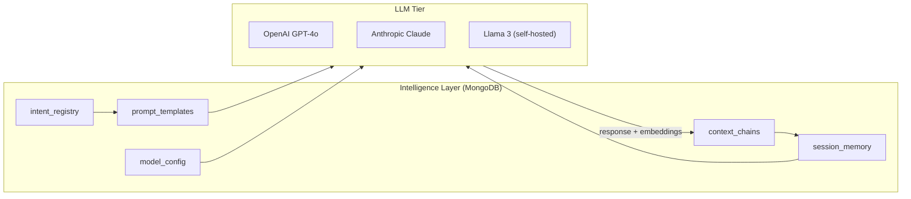
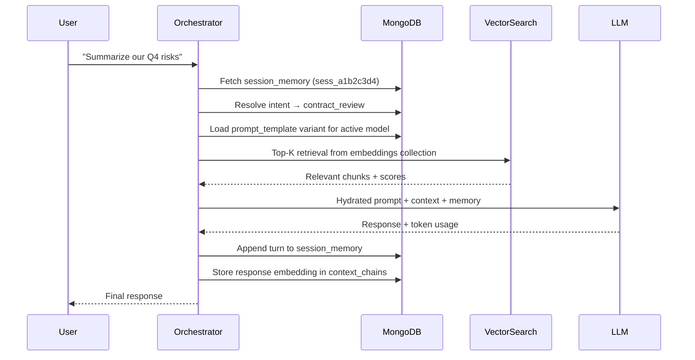

# MongoDB 4 AI — Build Your Brain in Mongo

> *"The challenge isn't where your business records live — it's where your Intelligence Layer breathes."*

---

## The Problem

If you're building a **Master AI** on top of a relational database, you're trying to map the fluid, unpredictable nature of LLM reasoning into static tables.

Every time a model update changes how prompts are structured or how context is retrieved, a relational schema breaks. Migrations stall. DBAs get paged. Your AI roadmap slips by months.

**MongoDB gives you a polymorphic data layer that evolves at the speed of AI — not the speed of a schema change approval.**

Build your orchestration layer — prompts, memory, and intent — in MongoDB. Swap models and strategies in **days, not months.**

---

## Intelligence Layer Architecture



---

## MongoDB Schema Examples

### 1. Prompt Template — Polymorphic by Model

Every LLM speaks a different dialect. A rigid table would need a column per model variant and a migration every time a new one ships. MongoDB lets each document carry its own shape.

```json
// Collection: prompt_templates
{
  "_id": "tmpl_summarize_v3",
  "name": "summarize_document",
  "version": 3,
  "created_at": "2025-11-01T09:00:00Z",
  "variants": {
    "openai-gpt-4o": {
      "system": "You are a concise document analyst.",
      "user_template": "Summarize the following in {{max_sentences}} sentences:\n\n{{document}}"
    },
    "anthropic-claude-3-5": {
      "system": "Analyze and compress the following text.",
      "user_template": "<document>{{document}}</document>\nReturn a {{max_sentences}}-sentence summary."
    },
    "llama-3-70b": {
      "prompt_template": "[INST] Summarize this in {{max_sentences}} sentences: {{document}} [/INST]"
    }
  },
  "tags": ["summarization", "rag", "production"]
}
```

---

### 2. Session Memory — Rolling Context Window

LLMs are stateless. MongoDB stores the conversational memory that your orchestration layer hydrates into every request — natively, without joins, without a separate cache layer.

```json
// Collection: session_memory
{
  "_id": "sess_a1b2c3d4",
  "user_id": "usr_9912",
  "model": "openai-gpt-4o",
  "created_at": "2026-01-15T14:22:00Z",
  "last_active": "2026-01-15T14:55:00Z",
  "context_window_tokens": 8192,
  "turns": [
    {
      "turn": 1,
      "role": "user",
      "content": "What are the key risks in our Q4 report?",
      "timestamp": "2026-01-15T14:22:10Z",
      "embedding_ref": "emb_001"
    },
    {
      "turn": 2,
      "role": "assistant",
      "content": "The top three risks identified are supply chain exposure, FX volatility, and regulatory headwinds in EMEA.",
      "timestamp": "2026-01-15T14:22:14Z",
      "tokens_used": 312,
      "embedding_ref": "emb_002"
    }
  ],
  "metadata": {
    "session_type": "document_qa",
    "source_doc_ids": ["doc_q4_2025_report"],
    "user_tier": "enterprise"
  }
}
```

---

### 3. Intent Registry — The Routing Brain

Map natural language intents to orchestration strategies without touching application code. When the model changes, you update a document — not a deployment.

```json
// Collection: intent_registry
{
  "_id": "intent_contract_review",
  "label": "contract_review",
  "description": "User wants to review, redline, or summarize a contract",
  "confidence_threshold": 0.82,
  "routing": {
    "primary_model": "anthropic-claude-3-5",
    "fallback_model": "openai-gpt-4o",
    "prompt_template_id": "tmpl_contract_review_v2",
    "tools_enabled": ["vector_search", "pdf_parser", "citation_extractor"]
  },
  "rag_config": {
    "collection": "contract_embeddings",
    "top_k": 8,
    "similarity_metric": "cosine",
    "min_score": 0.75
  },
  "guardrails": {
    "pii_redaction": true,
    "max_output_tokens": 4096,
    "content_filter": "legal_safe"
  }
}
```

---

### 4. Model Config — Swap Providers Without Code Changes

```json
// Collection: model_config
{
  "_id": "cfg_production_2026_q1",
  "active": true,
  "effective_date": "2026-01-01T00:00:00Z",
  "primary": {
    "provider": "openai",
    "model": "gpt-4o",
    "api_version": "2025-12-01",
    "temperature": 0.3,
    "max_tokens": 8192,
    "timeout_ms": 15000
  },
  "fallback": {
    "provider": "anthropic",
    "model": "claude-3-5-sonnet-20241022",
    "temperature": 0.3,
    "max_tokens": 8192,
    "timeout_ms": 20000
  },
  "cost_controls": {
    "monthly_budget_usd": 5000,
    "per_request_cap_usd": 0.50,
    "alert_threshold_pct": 80
  }
}
```

---

## Context Chain Flow



---

## Model Swap Lifecycle


---

## Why MongoDB Wins for AI

| Concern | Rigid Schema | MongoDB Intelligence Layer |
|---|---|---|
| New model with different prompt format | Migration + downtime | Add a variant field to the document |
| A/B test two orchestration strategies | Complex join tables | Two documents, one feature flag |
| Variable-length conversation turns | Unbounded row growth | Native array subdocuments |
| Add guardrails config per intent | ALTER TABLE + deploy | Update one document |
| Swap LLM provider | Code change + schema change | Update `model_config`, done |
| Vector search on memory embeddings | Extension pain | Atlas Vector Search, native |

---

## Getting Started

```bash
git clone https://github.com/jgschmitz/MongoDB-4-AI.git
cd MongoDB-4-AI

export MONGODB_URI="mongodb+srv://<user>:<pass>@cluster.mongodb.net/ai_brain"
```

Seed the collections with the schemas above and wire your orchestration layer to read `model_config`, resolve intents via `intent_registry`, and persist memory to `session_memory`. Your intelligence layer now evolves independently of everything else.

---

## Contributing

PRs welcome. If you're building an AI orchestration layer on MongoDB and want to share schema patterns, open an issue or drop a pull request.

---

*Built for engineers who are done waiting on the schema approval to ship their AI.*
